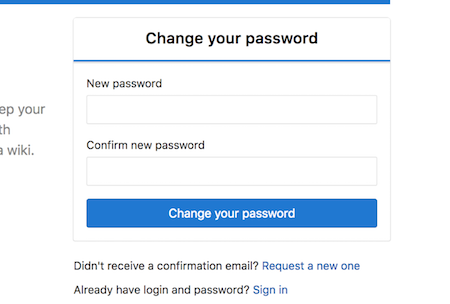
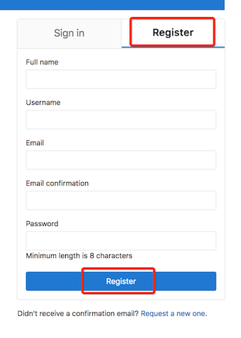
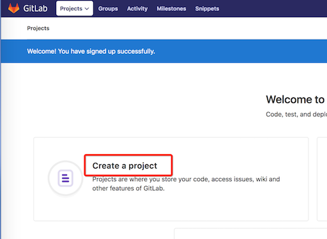
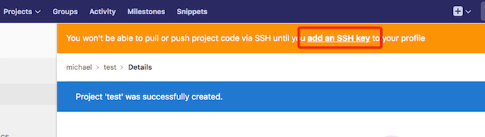
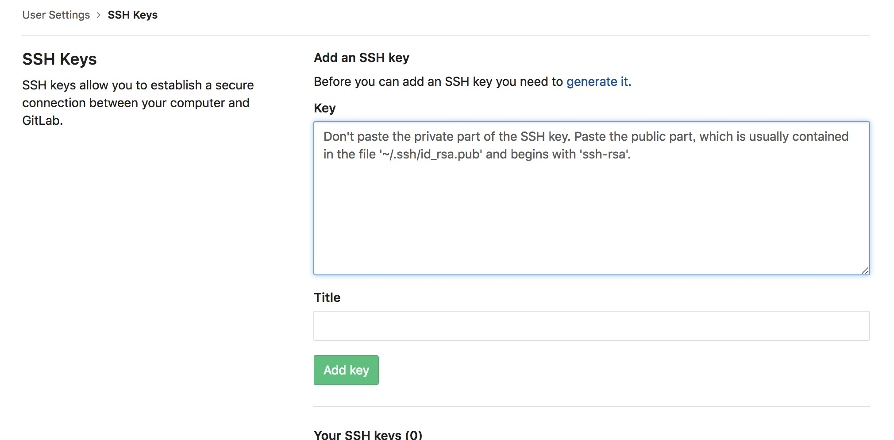
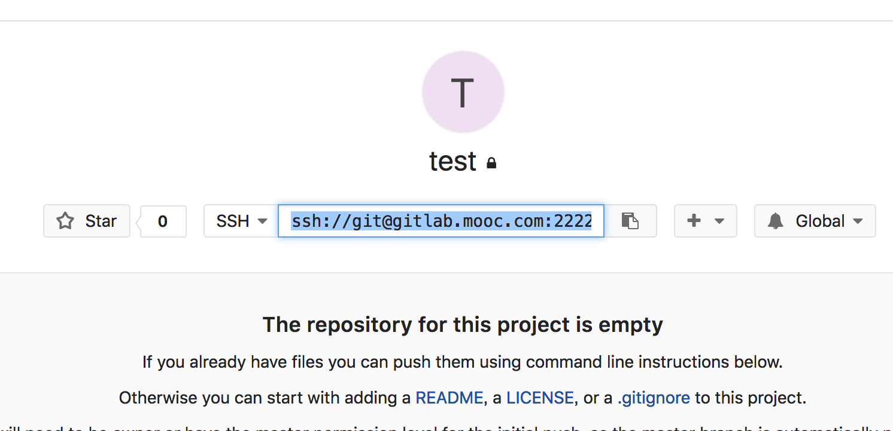
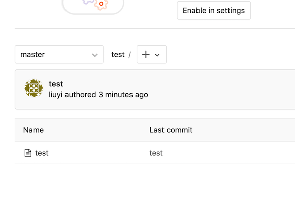

# GitLab安装、使用教程（Docker版）
## 一、下载镜像
官方版本是：gitlab/gitlab-ce:latest，为了提升速度我们这里使用阿里云的仓库
```bash
$ docker pull registry.cn-hangzhou.aliyuncs.com/imooc/gitlab-ce:latest
```

## 二、运行GitLab容器
使用docker命令运行容器，注意修改hostname为自己喜欢的名字，-v部分挂载目录要修改为自己的目录。  
端口映射这里使用的都是安全端口，如果大家的环境没有端口限制或冲突可以使用与容器同端口，如：-p 443:443 -p 80:80 -p 22:22
#### 1. 生成启动文件 - start.sh
```bash
$ cat <<EOF > start.sh
#!/bin/bash
HOST_NAME=gitlab.mooc.com
GITLAB_DIR=`pwd`
docker stop gitlab
docker rm gitlab
docker run -d \\
    --hostname \${HOST_NAME} \\
    -p 8443:443 -p 8080:80 -p 2222:22 \\
    --name gitlab \\
    -v \${GITLAB_DIR}/config:/etc/gitlab \\
    -v \${GITLAB_DIR}/logs:/var/log/gitlab \\
    -v \${GITLAB_DIR}/data:/var/opt/gitlab \\
    registry.cn-hangzhou.aliyuncs.com/imooc/gitlab-ce:latest
EOF
```
#### 2. 运行start.sh 启动gitlab
```bash
$ sh start.sh
```

#### 3. 配置环境
* 修改host文件，使域名可以正常解析
> 127.0.0.1 gitlab.mooc.com

* 修改ssh端口（如果主机端口使用的不是22端口）
> 修改文件：${GITLAB_DIR}/config/gitlab.rb
> 找到这一行：# gitlab_rails['gitlab_shell_ssh_port'] = 22
> 把22修改为你的宿主机端口（这里是2222）。然后将注释去掉。

* 重新启动容器
```bash
$ sh start.sh
```

## 三、GitLab试用
#### 1. 打开首页
地址：http://gitlab.mooc.com:8080/  

#### 2. 设置管理员密码
首先根据提示输入管理员密码，这个密码是管理员用户的密码。对应的用户名是root，用于以管理员身份登录Gitlab。  


#### 3. 创建账号
设置好密码后去注册一个普通账号  


#### 4. 创建项目
注册成功后会跳到首页，我们创建一个项目，名字大家随意  


#### 5. 添加ssh key
项目建好了，我们加一个ssh key，以后本地pull/push就简单啦  


首先去到添加ssh key的页面  


然后拿到我们的sshkey 贴到框框里就行啦
怎么拿到呢？看下面：
```bash
#先看看是不是已经有啦，如果有内容就直接copy贴过去就行啦
$ cat ~/.ssh/id_rsa.pub

#如果上一步没有这个文件 我们就创建一个，运行下面命令（邮箱改成自己的哦），一路回车就好了
$ ssh-keygen -t rsa -C "youremail@example.com"
$ cat ~/.ssh/id_rsa.pub
```

#### 6. 测试一下
点开我们刚创建的项目，复制ssh的地址  


添加个文件试试（我的项目叫test）
```bash
#clone代码
$ git clone ssh://git@gitlab.mooc.com:2222/michael/test.git
#写一个文件
$ cd test && echo test > test
#push
$ git add .
$ git commit -m "test"
$ git push origin master
```

去gitlab上看看  


到这我们的gitlab就齐活啦！愉快的使用吧~

